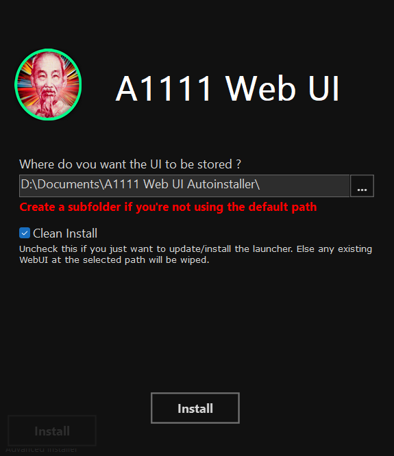

A1111 WebUI Easy Installer and Launcher
========================

This is an **unofficial** simplified installer for **[Automatic1111's Stable Diffusion WebUI](https://github.com/AUTOMATIC1111/stable-diffusion-webui)**

For simple installation, download the [**Latest Realease (.exe)**](https://github.com/EmpireMediaScience/A1111-Web-UI-Installer/releases) and follow the [**Installation Instructions**](#installing)

If you want to improve the installer, git clone or Fork & Pull Request (this project mainly uses [**Advanced Installer**](https://www.advancedinstaller.com/) and **Powershell**)

# INSTALLING

## **`⚠️ WARNING ⚠️`**

- This only Works on Windows 10 and 11 x64
- This has only been tested on **NVIDIA Graphics Cards** ([**Make sure your drivers are up to date !**](https://www.nvidia.com/download/index.aspx)
)
- This installer installs the original [Automatic1111 Stable Diffusion WebUI](https://github.com/AUTOMATIC1111/stable-diffusion-webui) repository **but is not affiliated with it**, if you get questions or errors after clicking **`LAUNCH WEBUI`**, they'll be related to the WebUI itself and not this installer, so do not ask or report them here, but [**here**](https://github.com/AUTOMATIC1111/stable-diffusion-webui/issues/new/choose)
- On the other hand, if you find a glitch before that or have a feature request, please [**fill an issue**](https://github.com/EmpireMediaScience/A1111-Web-UI-Installer/issues) and more importantly **join [the new Automatic1111's SD WebUI discord](https://discord.gg/xU8y74HG4d) to discuss the project and get general help about the WebUI**
 > ⚠️ This installer will always clone the latest bleeding edge update of the WebUI. Some Updates can break it

## **The Installer**
1. Download the [**latest release**](https://github.com/EmpireMediaScience/A1111-Web-UI-Installer/releases) and run it
2. If everything goes right you'll be greated with this screen :
 

3. **Select where you want to install the WebUI**
   >Default is fine but if you want to install things somewhere else, it is highly recommended to do it in a dedicated empty folder, else it's going to be pretty messy
4. **"Clean Install"**: Keep it checked if this is your first install via this Auto Installer. Uncheck it if you only want to update the Launcher and keep your existing WebUI intact (with your settings/models/extensions etc.)
      >**Note** (experimented users only): It ***may*** be possible to add the Launcher to an existing WebUI folder that you had manually git cloned (without this installer), as long as you move the WebUI folder into a subfolder, and chose said subfolder as the Install Path during the install. **But I haven't tested it and it could result in some random stuff**
5. Click <kbd>Install</kbd> and **remember, this can take a while**
6.  Once installed, a folder will open with a shortcut called ***A1111 WebUI (Pin to Taskbar)***
7.  You can drag & drop it on your taskbar if you wish, this is the launcher for the WebUI
8.  Launch the shortcut to open the **[Custom Launcher](#the-launcher)**
9.  It should install all the dependencies and ask you if you want to download the base SD model to generate images
    >⚠️Click "No" only if you already have one or more models somewhere, and don't forget to select the folder where they're stored in the launcher
10. Once you've selected what you wanted in the launcher, click **`LAUNCH WEBUI`**, this will quit the launcher and proceed in the terminal window, logging what it's doing 
      >⚠️**Be patient** this will take a while at first, when it's ready, it will open the webUI in your browser

      >⚠️**Read the WARN message**
11. When you're done using the WebUI, close the browser tab & close the terminal window
    

# THE LAUNCHER

When double clicking ***A1111 WebUI (Pin to Taskbar)*** You should be greeted with the launcher

## Features

## **`General Settings`**
 > The **<kbd>Force</kbd>** buttons will execute the relevant function as soon as you click instead of waiting for launch
- [x] **Auto-Update WebUI** : This will update (git pull) the WebUI everytime you launch it
- [x] **Auto-Update Extensions** : Same thing but with the extensions
- [x] **Clear Generated Images** : This will clear all previously generated images from the outputs folder at launch, to give you a blank slate for this session. 
   > ⚠️ The images are permanently deleted ! A pop up will ask you for confirmation at launch if enabled, and you'll also be able to skip the deletion without disabling it.
## **`Launch Options`**
- [x] **Low VRAM** : Allows cards with low VRAM to be able to generate images, this will increase render time, but will make things smooth
- [x] **Xformers** : Greatly speeds up RTX 3000 / 4000 cards, can sometimes work with previous gens cards as well !
- **`Checkpoint Folder`** : If you don't have a specific checkpoint folder, do not click this, else select it there 💡*click the path to reset*
- **`Default VAE`** : This will allow you to select a default separate for all models VAE file 💡*click the path to reset*
- **Additional Arguments** : If you know what you're doing, you can add additional launch arguments for the UI here, as you would have done in webui-user.bat. 
  >⚠️ ***Click SAVE to confirm the additional arguments, else they won't be saved***

## **`Misc`**
- Launch Options Overview for easy verification & debug
- Launcher Version displayed
- Main GPU & VRAM displayed
- Ablity to copy the WebUI Commit Hash (practical for opening GitHub issues)
- Direct link to the Issues section of the Installer/Launcher Github
- Direct link to the Issues section of the WebUI
- (Experienced users) You can add "skip" at the end of the "A1111 WebUI (Pin to Taskbar)" shortcut target to go straight to the Stable Diffusion WebUI with your existing settings
